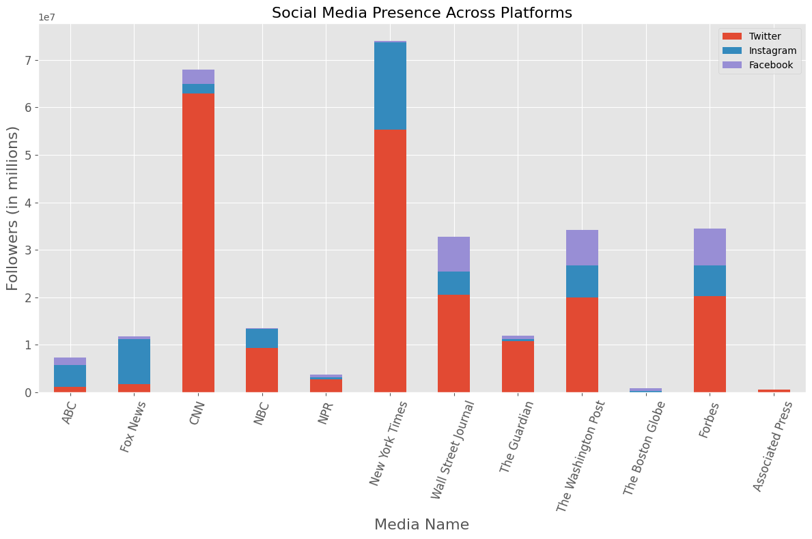
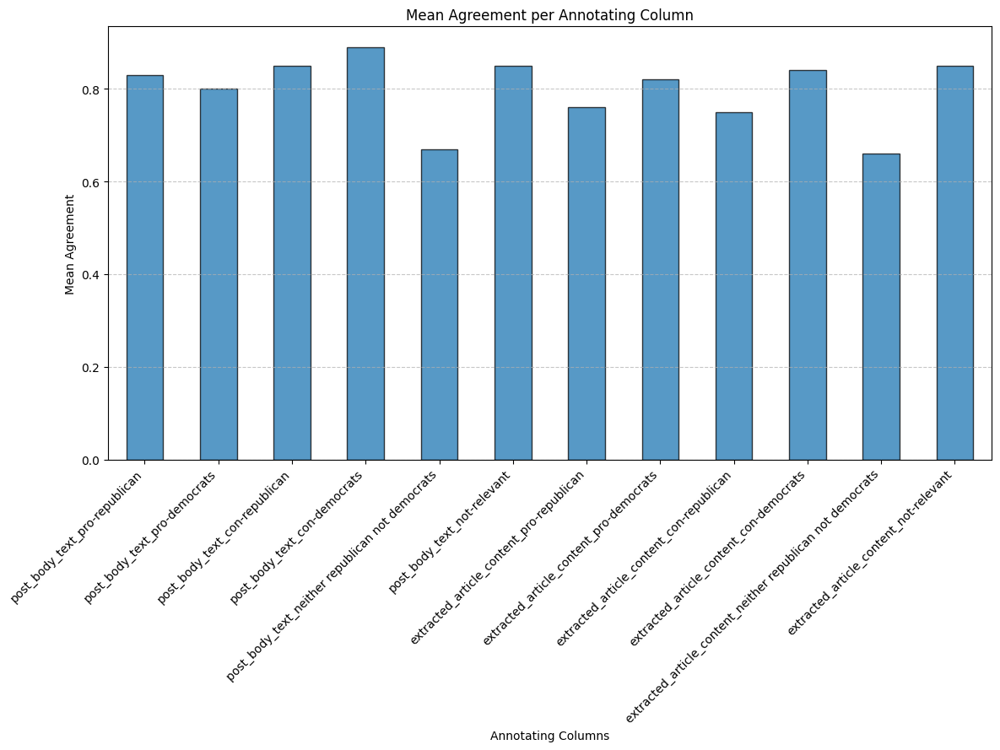
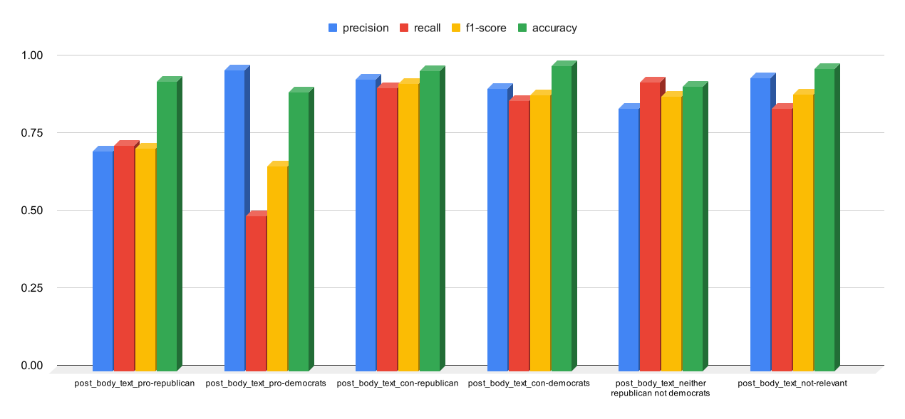
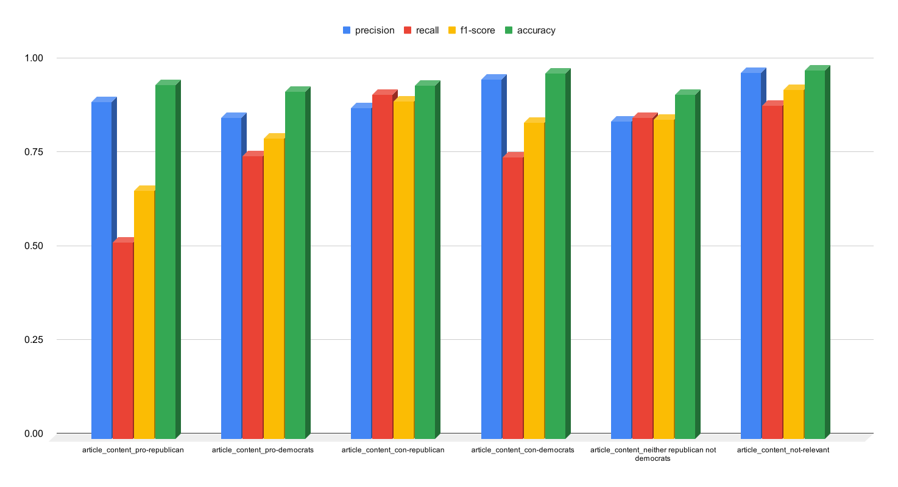

<h1 align="center">The Carter Center for AI.DataLab</a></h1>
<h5 align="center"> If you like our project, please give us a star ⭐ on GitHub for the latest update.</h5>
<h5 align="center">

  

<b>Figure 1: Number of followers of various news outlets across multiple social media.</b>

# 👩‍💻Human Annotations
To make it uniform, an annotation guideline was first prepared, and all human annotators followed it. You can read it [here](https://github.com/swati-rajwal/c2_fall_2024_ai_data_lab/blob/main/docs/Annotator%20Guidelines%20for%20Labeling%20Political%20Tweets%20and%20Articles.pdf).
1. The dataset was labeled to analyze the sentiment and political focus of tweets and their associated article content. The primary labels assigned include:
  * Pro-Republican: Indicates that the content positively supports Republicans.
  * Pro-Democrats: Indicates that the content positively supports Democrats.
  * Con-Republican: Highlights content critical of Republicans.
  * Con-Democrats: Highlights content critical of Democrats.
  * Neither Republican nor Democrat: This applies to political content that does not specifically relate to either party.
  * Not Relevant: Marks content unrelated to politics.
    
2. The annotation focused on two sections:
  * Tweet Text: The sentiment and political inclination were determined from the post's text.
  * Article Content: Sentiment and political focus were assessed from linked articles.

# 🤝Annotations Agreements

  

<b>Figure 2: Agreement level across annotating columns.</b>

# 🎯Training RoBERTa

  

<b>Figure 3: RoBERTa results on gold standard for tweets only.</b>

## Training Parameters

- **output_dir**: `./results/post_body` - Directory to save the model and checkpoints.
- **eval_strategy**: `epoch` - Evaluates the model at the end of each epoch.
- **learning_rate**: `1e-5` - Learning rate for the optimizer.
- **per_device_train_batch_size**: `16` - Batch size per device (e.g., GPU) for training.
- **num_train_epochs**: `25` - Total number of training epochs.
- **weight_decay**: `0.01` - Weight decay to prevent overfitting.
- **save_strategy**: `epoch` - Saves checkpoints at the end of each epoch.
- **logging_dir**: `./logs/post_body` - Directory for logs.
- **logging_steps**: `10` - Logs every 10 steps during training.
- **save_total_limit**: `1` - Retains only the most recent checkpoint.
- **load_best_model_at_end**: `True` - Loads the best model at the end of training.

  

<b>Figure 4: RoBERTa results on gold standard for extracted articles only.</b>

